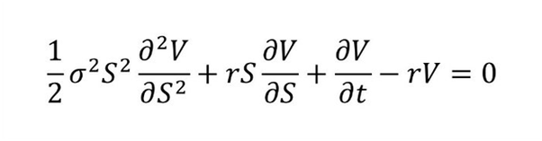

```{r setup, include=F}
knitr::opts_chunk$set(echo = TRUE)
```

 **Open this file in R Studio to see the code that generated the HTML file.**

This is an [R Notebook](https://bookdown.org/yihui/rmarkdown/notebook.html). R Notebooks mix R code and Markdown formatting syntax to create HTML, PDF, and MS Word documents. For more details on using R Markdown, see <http://rmarkdown.rstudio.com> or [Chapter 27 of R for Data Science](https://r4ds.had.co.nz/r-markdown.html) for the basics. For much more, here's a [complete book on Markdown and R](https://bookdown.org/yihui/rmarkdown/).

In short, R Markdown lets us combine our code with a document that displays the code's output, such as tables and graphs. There's no need to do your code one place and then put things into a Word or Google Doc. **Markdown itself has nothing to do with R - it is a way to format a document using plain text.** But, RStudio allows us to mix Markdown, which creates the formatted text in our document, with R, which does the statistical analysis. 

See the **Knit** button at the top? The first choice under this is **Preview Notebook**. This will let you see what this file will look like, text, code, figures, and all. It will open up a new window. 

We can also **knit**, or render, the document in the output of our choosing. For now, we will create an HTML file from this document. You can also create a PDF or a Word file. You can find these options under the Preview menu.

When you create an R Notebook for the first time, that button is going to say **Preview**, rather than **Knit**. However, once you knit as an HTML file, it will change to **Knit**.

**Very important**: In R Notebooks, you need to run the code chunks first in order to have them show up in the Preview and final, knitted documents.

**Very important**: While R Notebooks use Markdown, they are not the same as R Markdown documents. Go under the `File` menu. See how you can create an `R Notebook` and an `R Markdown` document? You want an `R Notebook` for what we're doing.

Lots of other programs use Markdown, so learning it is useful. If you are an Apple fan and read [Daring Fireball](https://daringfireball.net/projects/markdown/syntax), John Gruber and Aaron Swartz created the [Markdown language](https://en.wikipedia.org/wiki/Markdown).


## Running Our First Chunk
When you execute code within the notebook, the results appear beneath the code. Try executing this chunk by clicking the *Run* button within the chunk or by placing your cursor inside it and pressing *Cmd+Shift+Enter* on a Mac or *Ctrl-Shift-Enter on a PC*. 


```{r summary}
summary(cars)
```

Try this code chunk too.

```{r plot}
plot(cars)
```

Add a new chunk by clicking the *Insert New Code Chunk* button on the toolbar or by pressing *Cmd+Option+I* on a Mac or *Ctrl+Option+I* on a PC. You will then type your R code inside.

When you save the notebook, an HTML file containing the code and output will be saved alongside it (click the *Preview* button or press *Cmd+Shift+K* on a Mac or *Ctrl-Shift-K* to preview the HTML file). 

**Very Important**: The preview shows you a rendered HTML copy of the contents of the editor. Consequently, unlike *Knit*, *Preview* does not run any R code chunks. Instead, the output of the chunk when it was last run in the editor is displayed.

## YAML Header

The options at the very top are called a `YAML` header. It contains options for the entire document. We are keeping things simple for now, but there's a lot you can include up there. Mine looks like this:

```
---
title: "01-notebook-example"
author: "Adam Aiken"
date: '2022-01-25'
output:
  html_document:
    df_print: paged
  html_notebook: default
---
```

Changing the title option changes the title of the file R Studio generates. You can also change the date and author headers, which show up at the top of the output. 


## The Global Environment

When you run the code chunks, you can choose to create data sets and variables that are stored in the *R Global Environment*. For example, run the following chunk:

```{r assign}
c <- cars
```

This is assigning the built-in data set `cars` to c. You will see a new data frame created under `Data` in the Global Environment.

Let's install and load the `tidyverse` package (or library) and look at some Starwars data. You can install a package using the `Packages` tab in the bottom-right of RStudio, or with the `install.packages("tidyverse")` command. On your own computer, once you install a package, you don't need to do it again (though it is a good idea to update your packages occasionally). 

Next, let's add the Starwars data set to our global environment. Note that since the data was loaded as part of the `tidyverse`, we don't have to add it to the global environment to use it. 

If you have any other data saved in your global environment, you can use the **broom button** to delete it. You can also use the RStudio GUI to **Import Datasets**, though I think it is easier to do that with code. We'll see an example below. You can import Excel files, CSV files, STATA files, SAS files, etc.

```{r star}
library(tidyverse)
dplyr::starwars
star <- dplyr::starwars
# This is a code comment. It won't run, but you can use them to make notes for yourself in your code. 
# They are especially useful when creating R scripts, since these don't have all of the Markdown text and output.
# You can highlight multiple lines and type SHIFT-COMMAND-C to comment them all at once.
# star <- dplyr::starwars is taking the starwars data and saving it to a tibble in the global environment. This would then let you edit the data, etc.
```

## Where Do My Files Live?
So far, we haven't imported any data from our own computers. The data used has been ``built-in'' to R (or an R library). We need to talk about **file paths** and a relative file structure.

I am going to follow this example from Jenny Bryan at RStudio and use the `here` package: <https://github.com/jennybc/here_here>. Let's install and load it.

```{r}
library(here)
here::here()
```

This is my main folder for our materials tonight. How did `here` find it, since this document lives in a sub-folder? You want to be very careful how you set up your folders for data projects. Do this:

1. Create a folder called **elon-r-datacamp**. This folder could live in your Documents folder on your computer.
2. Inside this folder, create an **RStudio project**. What are projects? This is the file that you will open every time you work on something for that project and gives you a *home base*. You can create a new project in the upper-right of RStudio. Check out [Chapter 8 of R For Data Science](https://r4ds.had.co.nz/workflow-projects.html) for the details.
3. Inside this folder, create additional folders, such as **data** and **output**. Avoid spaces, capital letters, and special characters in your names.
4. Inside of the **data** folder, save the `ncbreweries.csv` file from our course Github page.

When I used the here::here() command above, R looked through my folders until it found my RStudio project file, which lives in my **elon-r-datacamp** folder. My relative path is **.../elon-r-datacamp/data** if I want to load in a data file. 

Why do this? All of your computers have different user names, so you can't just copy and paste the full path names! My files actually live in the **/Users/adamaiken/elon-r-datacamp** folder. Your folder obviously won't have this name. But, if we all have the same folder names **below** our main folder, then we can all use the same **relative file paths**. This will mean that you can share code, without changing path names to load in data.

I know this is all kind of confusing, but it will get easier with examples and practice. Let's load in some actual data to see how this works with the `here` package.

```{r here-example}
nc_brew1 <- read_csv(here::here("data", "ncbreweries.csv"))
```

Remember, `here` says that it will start looking in the **elon-r-datacamp** folder. I then use the `here::here()` function to navigate down folders, into **data**, until I find my .csv file with breweries data.

`here` is making it easy for us to write `read_csv("//Users/adamaiken/elon-r-datacamp/data/ncbreweries.csv")`. In fact, I'll try that now on my machine, just to show you that it works.

```{r read-csv-no-here}
nc_brew2 <- read_csv("/Users/adamaiken/elon-r-datacamp/data/ncbreweries.csv")
```

There's another way to do this, without using `here::here`. This file lives in **/Users/adamaiken/elon-r-datacamp/**. By default, R Notebook files start their relative path in the same folder that they live in. So, if my .csv file lives in the **data** folder in the directory that my .Rmd file lives in, I can access it like this.

```{r read-csv-relative}
nc_brew3 <- read_csv("data/ncbreweries.csv")
```

When I don't use `here::here`, path names are relative to where a particular .Rmd file lives, rather than where my single project file lives. I like using `here::here`, since it starts at the very top of the file structure and makes it very clear that we are accessing a data folder for a particular lab or project.

By the way, we've now loaded in the same data set three times to our global environment!

## More On Chunks

If you're looking at my code, you'll notice that I have some text in between the curly brackets in my chunks. These are **chunk options**. They let me tell R specific instructions to follow when running the code inside that chunk. First, `r` just means that I have R code inside the chunk. RStudio can actually run other languages, such as SQL and Python. Then, the text that follows is the name of the chunk. Keep you names short, but informative, with no spaces or special characters. Here's an example without the curly brackets:

```
r setup, include=F
```

Note that there is no comma between `r` and `setup`, the name that I gave this chunk. I like to have a `setup` chunk at the top of my code that contains commands that are relevant to the entire document. I'll usually load the libraries (packages) that I want there. All code chunks **must have different names**, so if you copy and paste chunks, but forget to change the names, you'll get an `duplicate label` error at the top of your notebook.

Options go after the comma. The first, `include=F`, means to not include this code in the R Notebook output, but to still run the code. If you set this to `F`, then the code will not show up in the final document. This might be what you want in your final report. 

You can also turn off `warning`, `error`, and `message`. Set `warning=F` to keep the warning messages out of your final document. Some code generates messages, such as `read_csv`. You can remove these from the document output by setting `message=F`.

Other important options include things that affect figure output, such as size or alignment.

You can read more about all of the options [here](https://yihui.org/knitr/options/#code-evaluation). 

## Other Formatting

See [Chapter 27.3 of R For Data Science](https://r4ds.had.co.nz/r-markdown.html) for more on how to create headers, lists, and tables in Markdown. 


```
Text formatting 
------------------------------------------------------------

*italic*  or _italic_
**bold**   __bold__
`code`
superscript^2^ and subscript~2~

Headings
------------------------------------------------------------

# 1st Level Header

## 2nd Level Header

### 3rd Level Header

Lists
------------------------------------------------------------

*   Bulleted list item 1

*   Item 2

    * Item 2a

    * Item 2b

1.  Numbered list item 1

1.  Item 2. The numbers are incremented automatically in the output.

Links and images
------------------------------------------------------------

<http://aaiken1.github.io>

[linked phrase](http://aaiken1.github.io)


Tables 
------------------------------------------------------------

First Header  | Second Header
------------- | -------------
Content Cell  | Content Cell
Content Cell  | Content Cell

```

Text formatting 
------------------------------------------------------------

*italic*  or _italic_
**bold**   __bold__
`code`
superscript^2^ and subscript~2~

Headings
------------------------------------------------------------

# 1st Level Header

## 2nd Level Header

### 3rd Level Header

Lists
------------------------------------------------------------

*   Bulleted list item 1

*   Item 2

    * Item 2a

    * Item 2b

1.  Numbered list item 1

1.  Item 2. The numbers are incremented automatically in the output.

Links and images
------------------------------------------------------------

<http://aaiken1.github.io>

[linked phrase](http://aaiken1.github.io)



Tables 
------------------------------------------------------------

First Header  | Second Header
------------- | -------------
Content Cell  | Content Cell
Content Cell  | Content Cell
